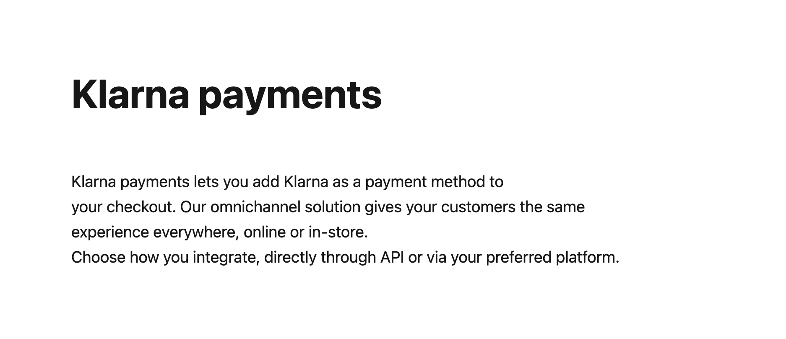

<div align="left">

[](https://klarna.com)

# Klarna<a id="klarna"></a>

The payments API is used to create a session to offer Klarna's payment methods as part of your checkout. As soon as the purchase is completed the order should be read and handled using the [`Order Management API`](https://docs.klarna.com/api/ordermanagement).

**Note:** Examples provided in this section includes full payloads, including all supported fields , required and optionals. In order to implement a best in class request we recommend you don't include customer details when initiating a payment session. Refer to [Initiate a payment](https://docs.klarna.com/klarna-payments/integrate-with-klarna-payments/step-1-initiate-a-payment/) section for further details.

Read more on [Klarna payments](https://docs.klarna.com/klarna-payments/).


</div>

## Table of Contents<a id="table-of-contents"></a>

<!-- toc -->

- [Requirements](#requirements)
- [Installation](#installation)
- [Getting Started](#getting-started)
- [Async](#async)
- [Raw HTTP Response](#raw-http-response)
- [Reference](#reference)
  * [`klarnapayments.payment.cancel_authorization`](#klarnapaymentspaymentcancel_authorization)
  * [`klarnapayments.payment.create_order`](#klarnapaymentspaymentcreate_order)
  * [`klarnapayments.payment.create_session`](#klarnapaymentspaymentcreate_session)
  * [`klarnapayments.payment.generate_customer_token`](#klarnapaymentspaymentgenerate_customer_token)
  * [`klarnapayments.payment.get_session_details`](#klarnapaymentspaymentget_session_details)
  * [`klarnapayments.payment.update_session_details`](#klarnapaymentspaymentupdate_session_details)

<!-- tocstop -->

## Requirements<a id="requirements"></a>

Python >=3.7

## Installation<a id="installation"></a>
<div align="center">
  <a href="https://konfigthis.com/sdk-sign-up?company=Klarna&serviceName=Payments&language=Python">
    
  </a>
</div>

## Getting Started<a id="getting-started"></a>

```python
from pprint import pprint
from klarna_payments_python_sdk import KlarnaPayments, ApiException

klarnapayments = KlarnaPayments(
)

try:
    # Cancel an authorization
    klarnapayments.payment.cancel_authorization(
        authorization_token="authorizationToken_example",
    )
except ApiException as e:
    print("Exception when calling PaymentApi.cancel_authorization: %s\n" % e)
    pprint(e.body)
    pprint(e.headers)
    pprint(e.status)
    pprint(e.reason)
    pprint(e.round_trip_time)
```

## Async<a id="async"></a>

`async` support is available by prepending `a` to any method.

```python

import asyncio
from pprint import pprint
from klarna_payments_python_sdk import KlarnaPayments, ApiException

klarnapayments = KlarnaPayments(
)

async def main():
    try:
        # Cancel an authorization
        await klarnapayments.payment.acancel_authorization(
            authorization_token="authorizationToken_example",
        )
    except ApiException as e:
        print("Exception when calling PaymentApi.cancel_authorization: %s\n" % e)
        pprint(e.body)
        pprint(e.headers)
        pprint(e.status)
        pprint(e.reason)
        pprint(e.round_trip_time)

asyncio.run(main())
```

## Raw HTTP Response<a id="raw-http-response"></a>

To access raw HTTP response values, use the `.raw` namespace.

```python
from pprint import pprint
from klarna_payments_python_sdk import KlarnaPayments, ApiException

klarnapayments = KlarnaPayments(
)

try:
    # Cancel an authorization
    cancel_authorization_response = klarnapayments.payment.raw.cancel_authorization(
        authorization_token="authorizationToken_example",
    )
    pprint(cancel_authorization_response.headers)
    pprint(cancel_authorization_response.status)
    pprint(cancel_authorization_response.round_trip_time)
except ApiException as e:
    print("Exception when calling PaymentApi.cancel_authorization: %s\n" % e)
    pprint(e.body)
    pprint(e.headers)
    pprint(e.status)
    pprint(e.reason)
    pprint(e.round_trip_time)
```


## Reference<a id="reference"></a>
### `klarnapayments.payment.cancel_authorization`<a id="klarnapaymentspaymentcancel_authorization"></a>

Use this API call to cancel/release an authorization. If the `authorization_token` received during a Klarna Payments won’t be used to place an order immediately you could release the authorization.
Read more on **[Cancel an existing authorization](https://docs.klarna.com/klarna-payments/other-actions/cancel-an-authorization/)**.

#### 🛠️ Usage<a id="🛠️-usage"></a>

```python
klarnapayments.payment.cancel_authorization(
    authorization_token="authorizationToken_example",
)
```

#### ⚙️ Parameters<a id="⚙️-parameters"></a>

##### authorization_token: `str`<a id="authorization_token-str"></a>

#### 🌐 Endpoint<a id="🌐-endpoint"></a>

`/payments/v1/authorizations/{authorizationToken}` `delete`

[🔙 **Back to Table of Contents**](#table-of-contents)

---

### `klarnapayments.payment.create_order`<a id="klarnapaymentspaymentcreate_order"></a>

Use this API call to create a new order. Placing an order towards Klarna means that the Klarna Payments session will be closed and that an order will be created in Klarna's system.<br/>When you have received the `authorization_token` for a successful authorization you can place the order. Among the other order details in this request, you include a URL to the confirmation page for the customer.<br/>When the Order has been successfully placed at Klarna, you need to handle it either through the Merchant Portal or using [Klarna’s Order Management API](https://docs.klarna.com/api/payments/).
Read more on **[Create a new order](https://docs.klarna.com/klarna-payments/integrate-with-klarna-payments/step-3-create-an-order/)**.

#### 🛠️ Usage<a id="🛠️-usage"></a>

```python
create_order_response = klarnapayments.payment.create_order(
    order_amount=2000,
    order_lines=[
        {
            "image_url": "https://www.exampleobjects.com/logo.png",
            "merchant_data": "{\"customer_account_info\":[{\"unique_account_identifier\":\"test@gmail.com\",\"account_registration_date\":\"2017-02-13T10:49:20Z\",\"account_last_modified\":\"2019-03-13T11:45:27Z\"}]}",
            "name": "Running shoe",
            "product_url": "https://.../AD6654412.html",
            "quantity": 1,
            "quantity_unit": "pcs",
            "reference": "AD6654412",
            "tax_rate": 2000,
            "total_amount": 2000,
            "total_discount_amount": 500,
            "total_tax_amount": 333,
            "type": "physical",
            "unit_price": 2500,
        }
    ],
    purchase_country="GB",
    purchase_currency="GBP",
    authorization_token="authorizationToken_example",
    authorization_token="string_example",
    auto_capture=False,
    billing_address={
        "title": "Mr.",
        "attention": "Attn",
        "city": "London",
        "country": "GB",
        "email": "test.sam@test.com",
        "family_name": "Andersson",
        "given_name": "Adam",
        "phone": "+44795465131",
        "postal_code": "W1G 0PW",
        "region": "OH",
        "street_address": "33 Cavendish Square",
        "street_address2": "Floor 22 / Flat 2",
    },
    custom_payment_method_ids=[
        "string_example"
    ],
    customer={
        "title": "Mr.",
        "date_of_birth": "1978-12-31",
        "gender": "male",
        "organization_entity_type": "LIMITED_COMPANY",
        "type": "organization",
    },
    locale="en-GB",
    merchant_data="{\"order_specific\":[{\"substore\":\"Women's Fashion\",\"product_name\":\"Women Sweatshirt\"}]}",
    merchant_reference1="ON4711",
    merchant_reference2="hdt53h-zdgg6-hdaff2",
    merchant_urls={
        "confirmation": "https://www.example-url.com/confirmation",
        "notification": "https://www.example-url.com/notification",
        "push": "https://www.example-url.com/push",
        "authorization": "https://www.example-url.com/authorization",
    },
    order_tax_amount=333,
    payment_method_categories=[
        {
            "identifier": "klarna",
            "name": "Pay with Klarna",
        }
    ],
    shipping_address={
        "title": "Mr.",
        "attention": "Attn",
        "city": "London",
        "country": "GB",
        "email": "test.sam@test.com",
        "family_name": "Andersson",
        "given_name": "Adam",
        "phone": "+44795465131",
        "postal_code": "W1G 0PW",
        "region": "OH",
        "street_address": "33 Cavendish Square",
        "street_address2": "Floor 22 / Flat 2",
    },
    status="complete",
)
```

#### ⚙️ Parameters<a id="⚙️-parameters"></a>

##### order_amount: `int`<a id="order_amount-int"></a>

Total amount of the order including tax and any available discounts. The value should be in non-negative minor units. Eg: 25 Euros should be 2500.

##### order_lines: List[`OrderLine`]<a id="order_lines-listorderline"></a>

The array containing list of line items that are part of this order. Maximum of 1000 line items could be processed in a single order.

##### purchase_country: `str`<a id="purchase_country-str"></a>

The purchase country of the customer. The billing country always overrides purchase country if the values are different. Formatted according to ISO 3166 alpha-2 standard, e.g. GB, SE, DE, US, etc.

##### purchase_currency: `str`<a id="purchase_currency-str"></a>

The purchase currency of the order. Formatted according to ISO 4217 standard, e.g. USD, EUR, SEK, GBP, etc.

##### authorization_token: `str`<a id="authorization_token-str"></a>

##### authorization_token: `str`<a id="authorization_token-str"></a>

Authorization token.

##### auto_capture: `bool`<a id="auto_capture-bool"></a>

Allow merchant to trigger auto capturing.

##### billing_address: [`Address`](./klarna_payments_python_sdk/type/address.py)<a id="billing_address-addressklarna_payments_python_sdktypeaddresspy"></a>


##### custom_payment_method_ids: [`CreateOrderRequestCustomPaymentMethodIds`](./klarna_payments_python_sdk/type/create_order_request_custom_payment_method_ids.py)<a id="custom_payment_method_ids-createorderrequestcustompaymentmethodidsklarna_payments_python_sdktypecreate_order_request_custom_payment_method_idspy"></a>

##### customer: [`Customer`](./klarna_payments_python_sdk/type/customer.py)<a id="customer-customerklarna_payments_python_sdktypecustomerpy"></a>


##### locale: `str`<a id="locale-str"></a>

Used to define the language and region of the customer. The locale follows the format of [RFC 1766](https://datatracker.ietf.org/doc/rfc1766/), meaning its value consists of language-country. Read more on **[Supported Locals and Currencies](https://docs.klarna.com/klarna-payments/in-depth-knowledge/puchase-countries-currencies-locales/)**.

##### merchant_data: `str`<a id="merchant_data-str"></a>

Pass through field to send any information about the order to be used later for reference while retrieving the order details (max 6000 characters)

##### merchant_reference1: `str`<a id="merchant_reference1-str"></a>

Used for storing merchant's internal order number or other reference.

##### merchant_reference2: `str`<a id="merchant_reference2-str"></a>

Used for storing merchant's internal order number or other reference. The value is available in the settlement files. (max 255 characters).

##### merchant_urls: [`MerchantUrls`](./klarna_payments_python_sdk/type/merchant_urls.py)<a id="merchant_urls-merchanturlsklarna_payments_python_sdktypemerchant_urlspy"></a>


##### order_tax_amount: `int`<a id="order_tax_amount-int"></a>

Total tax amount of the order. The value should be in non-negative minor units. Eg: 25 Euros should be 2500.

##### payment_method_categories: List[`PaymentMethodCategory`]<a id="payment_method_categories-listpaymentmethodcategory"></a>

Available payment method categories

##### shipping_address: [`Address`](./klarna_payments_python_sdk/type/address.py)<a id="shipping_address-addressklarna_payments_python_sdktypeaddresspy"></a>


##### status: `str`<a id="status-str"></a>

The current status of the session. Possible values: 'complete', 'incomplete' where 'complete' is set when the order has been placed.

#### ⚙️ Request Body<a id="⚙️-request-body"></a>

[`CreateOrderRequest`](./klarna_payments_python_sdk/type/create_order_request.py)
#### 🔄 Return<a id="🔄-return"></a>

[`Order`](./klarna_payments_python_sdk/pydantic/order.py)

#### 🌐 Endpoint<a id="🌐-endpoint"></a>

`/payments/v1/authorizations/{authorizationToken}/order` `post`

[🔙 **Back to Table of Contents**](#table-of-contents)

---

### `klarnapayments.payment.create_session`<a id="klarnapaymentspaymentcreate_session"></a>

Use this API call to create a Klarna Payments session.<br/>When a session is created you will receive the available `payment_method_categories` for the session, a `session_id` and a `client_token`. The `session_id` can be used to read or update the session using the REST API. The `client_token` should be passed to the browser.
Read more on **[Create a new payment session](https://docs.klarna.com/klarna-payments/integrate-with-klarna-payments/step-1-initiate-a-payment/)**.

#### 🛠️ Usage<a id="🛠️-usage"></a>

```python
create_session_response = klarnapayments.payment.create_session(
    order_amount=2000,
    order_lines=[
        {
            "image_url": "https://www.exampleobjects.com/logo.png",
            "merchant_data": "{\"customer_account_info\":[{\"unique_account_identifier\":\"test@gmail.com\",\"account_registration_date\":\"2017-02-13T10:49:20Z\",\"account_last_modified\":\"2019-03-13T11:45:27Z\"}]}",
            "name": "Running shoe",
            "product_url": "https://.../AD6654412.html",
            "quantity": 1,
            "quantity_unit": "pcs",
            "reference": "AD6654412",
            "tax_rate": 2000,
            "total_amount": 2000,
            "total_discount_amount": 500,
            "total_tax_amount": 333,
            "type": "physical",
            "unit_price": 2500,
        }
    ],
    purchase_country="GB",
    purchase_currency="GBP",
    acquiring_channel="ECOMMERCE",
    attachment={
        "body": "{\"customer_account_info\":[{\"unique_account_identifier\":\"test@gmail.com\",\"account_registration_date\":\"2017-02-13T10:49:20Z\",\"account_last_modified\":\"2019-03-13T11:45:27Z\"}]}",
        "content_type": "application/vnd.klarna.internal.emd-v2+json",
    },
    authorization_token="string_example",
    billing_address={
        "title": "Mr.",
        "attention": "Attn",
        "city": "London",
        "country": "GB",
        "email": "test.sam@test.com",
        "family_name": "Andersson",
        "given_name": "Adam",
        "phone": "+44795465131",
        "postal_code": "W1G 0PW",
        "region": "OH",
        "street_address": "33 Cavendish Square",
        "street_address2": "Floor 22 / Flat 2",
    },
    client_token="eyJhbGciOiJIUzI1NiIsInR5cCI6IkpXVCJ9.ewogICJzZXNzaW9uX2lkIiA6ICIw",
    custom_payment_method_ids=[
        "string_example"
    ],
    customer={
        "title": "Mr.",
        "date_of_birth": "1978-12-31",
        "gender": "male",
        "organization_entity_type": "LIMITED_COMPANY",
        "type": "organization",
    },
    design="string_example",
    expires_at="2038-01-19T03:14:07.000Z",
    locale="en-US",
    merchant_data="{\"order_specific\":[{\"substore\":\"Women's Fashion\",\"product_name\":\"Women Sweatshirt\"}]}",
    merchant_reference1="ON4711",
    merchant_reference2="hdt53h-zdgg6-hdaff2",
    merchant_urls={
        "confirmation": "https://www.example-url.com/confirmation",
        "notification": "https://www.example-url.com/notification",
        "push": "https://www.example-url.com/push",
        "authorization": "https://www.example-url.com/authorization",
    },
    options={
        "color_border": "#FF9900",
        "color_border_selected": "#FF9900",
        "color_details": "#FF9900",
        "color_text": "#FF9900",
        "radius_border": "5px",
    },
    order_tax_amount=333,
    payment_method_categories=[
        {
            "identifier": "klarna",
            "name": "Pay with Klarna",
        }
    ],
    shipping_address={
        "title": "Mr.",
        "attention": "Attn",
        "city": "London",
        "country": "GB",
        "email": "test.sam@test.com",
        "family_name": "Andersson",
        "given_name": "Adam",
        "phone": "+44795465131",
        "postal_code": "W1G 0PW",
        "region": "OH",
        "street_address": "33 Cavendish Square",
        "street_address2": "Floor 22 / Flat 2",
    },
    status="complete",
    intent="buy",
)
```

#### ⚙️ Parameters<a id="⚙️-parameters"></a>

##### order_amount: `int`<a id="order_amount-int"></a>

Total amount of the order including tax and any available discounts. The value should be in non-negative minor units. Eg: 25 Euros should be 2500.

##### order_lines: List[`OrderLine`]<a id="order_lines-listorderline"></a>

The array containing list of line items that are part of this order. Maximum of 1000 line items could be processed in a single order.

##### purchase_country: `str`<a id="purchase_country-str"></a>

The purchase country of the customer. The billing country always overrides purchase country if the values are different. Formatted according to ISO 3166 alpha-2 standard, e.g. GB, SE, DE, US, etc.

##### purchase_currency: `str`<a id="purchase_currency-str"></a>

The purchase currency of the order. Formatted according to ISO 4217 standard, e.g. USD, EUR, SEK, GBP, etc.

##### acquiring_channel: `str`<a id="acquiring_channel-str"></a>

The acquiring channel in which the session takes place. Ecommerce is default unless specified. Any other values should be defined in the agreement.

##### attachment: [`Attachment`](./klarna_payments_python_sdk/type/attachment.py)<a id="attachment-attachmentklarna_payments_python_sdktypeattachmentpy"></a>


##### authorization_token: `str`<a id="authorization_token-str"></a>

Authorization token.

##### billing_address: [`Address`](./klarna_payments_python_sdk/type/address.py)<a id="billing_address-addressklarna_payments_python_sdktypeaddresspy"></a>


##### client_token: `str`<a id="client_token-str"></a>

Token to be passed to the JS client

##### custom_payment_method_ids: [`SessionCreateCustomPaymentMethodIds`](./klarna_payments_python_sdk/type/session_create_custom_payment_method_ids.py)<a id="custom_payment_method_ids-sessioncreatecustompaymentmethodidsklarna_payments_python_sdktypesession_create_custom_payment_method_idspy"></a>

##### customer: [`Customer`](./klarna_payments_python_sdk/type/customer.py)<a id="customer-customerklarna_payments_python_sdktypecustomerpy"></a>


##### design: `str`<a id="design-str"></a>

Design package to use in the session. This can only by used if a custom design has been implemented for Klarna Payments and agreed upon in the agreement. It might have a financial impact. Delivery manager will provide the value for the parameter.

##### expires_at: `datetime`<a id="expires_at-datetime"></a>

Session expiration date

##### locale: `str`<a id="locale-str"></a>

Used to define the language and region of the customer. The locale follows the format of [RFC 1766](https://datatracker.ietf.org/doc/rfc1766/), meaning its value consists of language-country. Default value is \\\"en-US\\\". Read more on **[Supported Locals and Currencies](https://docs.klarna.com/klarna-payments/in-depth-knowledge/puchase-countries-currencies-locales/)**.

##### merchant_data: `str`<a id="merchant_data-str"></a>

Pass through field to send any information about the order to be used later for reference while retrieving the order details (max 6000 characters)

##### merchant_reference1: `str`<a id="merchant_reference1-str"></a>

Used for storing merchant's internal order number or other reference.

##### merchant_reference2: `str`<a id="merchant_reference2-str"></a>

Used for storing merchant's internal order number or other reference. The value is available in the settlement files. (max 255 characters).

##### merchant_urls: [`MerchantUrls`](./klarna_payments_python_sdk/type/merchant_urls.py)<a id="merchant_urls-merchanturlsklarna_payments_python_sdktypemerchant_urlspy"></a>


##### options: [`Options`](./klarna_payments_python_sdk/type/options.py)<a id="options-optionsklarna_payments_python_sdktypeoptionspy"></a>


##### order_tax_amount: `int`<a id="order_tax_amount-int"></a>

Total tax amount of the order. The value should be in non-negative minor units. Eg: 25 Euros should be 2500.

##### payment_method_categories: List[`PaymentMethodCategory`]<a id="payment_method_categories-listpaymentmethodcategory"></a>

Available payment method categories

##### shipping_address: [`Address`](./klarna_payments_python_sdk/type/address.py)<a id="shipping_address-addressklarna_payments_python_sdktypeaddresspy"></a>


##### status: `str`<a id="status-str"></a>

The current status of the session. Possible values: 'complete', 'incomplete' where 'complete' is set when the order has been placed.

##### intent: `str`<a id="intent-str"></a>

Intent for the session. The field is designed to let partners inform Klarna of the purpose of the customer’s session.

#### ⚙️ Request Body<a id="⚙️-request-body"></a>

[`SessionCreate`](./klarna_payments_python_sdk/type/session_create.py)
session_request

#### 🔄 Return<a id="🔄-return"></a>

[`MerchantSession`](./klarna_payments_python_sdk/pydantic/merchant_session.py)

#### 🌐 Endpoint<a id="🌐-endpoint"></a>

`/payments/v1/sessions` `post`

[🔙 **Back to Table of Contents**](#table-of-contents)

---

### `klarnapayments.payment.generate_customer_token`<a id="klarnapaymentspaymentgenerate_customer_token"></a>

Use this API call to create a Klarna Customer Token.<br/>After having obtained an `authorization_token` for a successful authorization, this can be used to create a purchase token instead of placing the order. Creating a Klarna Customer Token results in Klarna storing customer and payment method details.
Read more on **[Generate a consumer token](https://docs.klarna.com/klarna-payments/in-depth-knowledge/customer-token/)**.

#### 🛠️ Usage<a id="🛠️-usage"></a>

```python
generate_customer_token_response = klarnapayments.payment.generate_customer_token(
    description="a",
    intended_use="SUBSCRIPTION",
    locale="en-GB",
    purchase_country="GB",
    purchase_currency="GBP",
    authorization_token="authorizationToken_example",
    billing_address={
        "title": "Mr.",
        "attention": "Attn",
        "city": "London",
        "country": "GB",
        "email": "test.sam@test.com",
        "family_name": "Andersson",
        "given_name": "Adam",
        "phone": "+44795465131",
        "postal_code": "W1G 0PW",
        "region": "OH",
        "street_address": "33 Cavendish Square",
        "street_address2": "Floor 22 / Flat 2",
    },
    customer={
        "title": "Mr.",
        "date_of_birth": "1978-12-31",
        "gender": "male",
        "organization_entity_type": "LIMITED_COMPANY",
        "type": "organization",
    },
)
```

#### ⚙️ Parameters<a id="⚙️-parameters"></a>

##### description: `str`<a id="description-str"></a>

Description of the purpose of the token.

##### intended_use: `str`<a id="intended_use-str"></a>

Intended use for the token.

##### locale: `str`<a id="locale-str"></a>

RFC 1766 customer's locale.

##### purchase_country: `str`<a id="purchase_country-str"></a>

ISO 3166 alpha-2 purchase country.

##### purchase_currency: `str`<a id="purchase_currency-str"></a>

ISO 4217 purchase currency.

##### authorization_token: `str`<a id="authorization_token-str"></a>

##### billing_address: [`Address`](./klarna_payments_python_sdk/type/address.py)<a id="billing_address-addressklarna_payments_python_sdktypeaddresspy"></a>


##### customer: [`Customer`](./klarna_payments_python_sdk/type/customer.py)<a id="customer-customerklarna_payments_python_sdktypecustomerpy"></a>


#### ⚙️ Request Body<a id="⚙️-request-body"></a>

[`CustomerTokenCreationRequest`](./klarna_payments_python_sdk/type/customer_token_creation_request.py)
#### 🔄 Return<a id="🔄-return"></a>

[`CustomerTokenCreationResponse`](./klarna_payments_python_sdk/pydantic/customer_token_creation_response.py)

#### 🌐 Endpoint<a id="🌐-endpoint"></a>

`/payments/v1/authorizations/{authorizationToken}/customer-token` `post`

[🔙 **Back to Table of Contents**](#table-of-contents)

---

### `klarnapayments.payment.get_session_details`<a id="klarnapaymentspaymentget_session_details"></a>

Use this API call to get a Klarna Payments session. You can read the Klarna Payments session at any time after it has been created, to get information about it. This will return all data that has been collected during the session.
Read more on **[Read an existing payment session](https://docs.klarna.com/klarna-payments/other-actions/check-the-details-of-a-payment-session/)**.

#### 🛠️ Usage<a id="🛠️-usage"></a>

```python
get_session_details_response = klarnapayments.payment.get_session_details(
    session_id="session_id_example",
)
```

#### ⚙️ Parameters<a id="⚙️-parameters"></a>

##### session_id: `str`<a id="session_id-str"></a>

session_id

#### 🔄 Return<a id="🔄-return"></a>

[`SessionRead`](./klarna_payments_python_sdk/pydantic/session_read.py)

#### 🌐 Endpoint<a id="🌐-endpoint"></a>

`/payments/v1/sessions/{session_id}` `get`

[🔙 **Back to Table of Contents**](#table-of-contents)

---

### `klarnapayments.payment.update_session_details`<a id="klarnapaymentspaymentupdate_session_details"></a>

Use this API call to update a Klarna Payments session with new details, in case something in the order has changed and the checkout has been reloaded. Including if the consumer adds a new item to the cart or if consumer details are updated.
Read more on **[Update an existing payment session](https://docs.klarna.com/klarna-payments/other-actions/update-the-cart/)**.

#### 🛠️ Usage<a id="🛠️-usage"></a>

```python
klarnapayments.payment.update_session_details(
    session_id="session_id_example",
    acquiring_channel="ECOMMERCE",
    attachment={
        "body": "{\"customer_account_info\":[{\"unique_account_identifier\":\"test@gmail.com\",\"account_registration_date\":\"2017-02-13T10:49:20Z\",\"account_last_modified\":\"2019-03-13T11:45:27Z\"}]}",
        "content_type": "application/vnd.klarna.internal.emd-v2+json",
    },
    authorization_token="string_example",
    billing_address={
        "title": "Mr.",
        "attention": "Attn",
        "city": "London",
        "country": "GB",
        "email": "test.sam@test.com",
        "family_name": "Andersson",
        "given_name": "Adam",
        "phone": "+44795465131",
        "postal_code": "W1G 0PW",
        "region": "OH",
        "street_address": "33 Cavendish Square",
        "street_address2": "Floor 22 / Flat 2",
    },
    client_token="eyJhbGciOiJIUzI1NiIsInR5cCI6IkpXVCJ9.ewogICJzZXNzaW9uX2lkIiA6ICIw",
    custom_payment_method_ids=[
        "string_example"
    ],
    customer={
        "title": "Mr.",
        "date_of_birth": "1978-12-31",
        "gender": "male",
        "organization_entity_type": "LIMITED_COMPANY",
        "type": "organization",
    },
    design="string_example",
    expires_at="2038-01-19T03:14:07.000Z",
    locale="en-GB",
    merchant_data="{\"order_specific\":[{\"substore\":\"Women's Fashion\",\"product_name\":\"Women Sweatshirt\"}]}",
    merchant_reference1="ON4711",
    merchant_reference2="hdt53h-zdgg6-hdaff2",
    merchant_urls={
        "confirmation": "https://www.example-url.com/confirmation",
        "notification": "https://www.example-url.com/notification",
        "push": "https://www.example-url.com/push",
        "authorization": "https://www.example-url.com/authorization",
    },
    options={
        "color_border": "#FF9900",
        "color_border_selected": "#FF9900",
        "color_details": "#FF9900",
        "color_text": "#FF9900",
        "radius_border": "5px",
    },
    order_amount=2000,
    order_lines=[
        {
            "image_url": "https://www.exampleobjects.com/logo.png",
            "merchant_data": "{\"customer_account_info\":[{\"unique_account_identifier\":\"test@gmail.com\",\"account_registration_date\":\"2017-02-13T10:49:20Z\",\"account_last_modified\":\"2019-03-13T11:45:27Z\"}]}",
            "name": "Running shoe",
            "product_url": "https://.../AD6654412.html",
            "quantity": 1,
            "quantity_unit": "pcs",
            "reference": "AD6654412",
            "tax_rate": 2000,
            "total_amount": 2000,
            "total_discount_amount": 500,
            "total_tax_amount": 333,
            "type": "physical",
            "unit_price": 2500,
        }
    ],
    order_tax_amount=333,
    payment_method_categories=[
        {
            "identifier": "klarna",
            "name": "Pay with Klarna",
        }
    ],
    purchase_country="GB",
    purchase_currency="GBP",
    shipping_address={
        "title": "Mr.",
        "attention": "Attn",
        "city": "London",
        "country": "GB",
        "email": "test.sam@test.com",
        "family_name": "Andersson",
        "given_name": "Adam",
        "phone": "+44795465131",
        "postal_code": "W1G 0PW",
        "region": "OH",
        "street_address": "33 Cavendish Square",
        "street_address2": "Floor 22 / Flat 2",
    },
    status="complete",
    intent="buy",
)
```

#### ⚙️ Parameters<a id="⚙️-parameters"></a>

##### session_id: `str`<a id="session_id-str"></a>

session_id

##### acquiring_channel: `str`<a id="acquiring_channel-str"></a>

The acquiring channel in which the session takes place. Ecommerce is default unless specified. Any other values should be defined in the agreement.

##### attachment: [`Attachment`](./klarna_payments_python_sdk/type/attachment.py)<a id="attachment-attachmentklarna_payments_python_sdktypeattachmentpy"></a>


##### authorization_token: `str`<a id="authorization_token-str"></a>

Authorization token.

##### billing_address: [`Address`](./klarna_payments_python_sdk/type/address.py)<a id="billing_address-addressklarna_payments_python_sdktypeaddresspy"></a>


##### client_token: `str`<a id="client_token-str"></a>

Token to be passed to the JS client

##### custom_payment_method_ids: [`SessionCustomPaymentMethodIds`](./klarna_payments_python_sdk/type/session_custom_payment_method_ids.py)<a id="custom_payment_method_ids-sessioncustompaymentmethodidsklarna_payments_python_sdktypesession_custom_payment_method_idspy"></a>

##### customer: [`Customer`](./klarna_payments_python_sdk/type/customer.py)<a id="customer-customerklarna_payments_python_sdktypecustomerpy"></a>


##### design: `str`<a id="design-str"></a>

Design package to use in the session. This can only by used if a custom design has been implemented for Klarna Payments and agreed upon in the agreement. It might have a financial impact. Delivery manager will provide the value for the parameter.

##### expires_at: `datetime`<a id="expires_at-datetime"></a>

Session expiration date

##### locale: `str`<a id="locale-str"></a>

Used to define the language and region of the customer. The locale follows the format of [RFC 1766](https://datatracker.ietf.org/doc/rfc1766/), meaning its value consists of language-country. Read more on **[Supported Locals and Currencies](https://docs.klarna.com/klarna-payments/in-depth-knowledge/puchase-countries-currencies-locales/)**.

##### merchant_data: `str`<a id="merchant_data-str"></a>

Pass through field to send any information about the order to be used later for reference while retrieving the order details (max 6000 characters)

##### merchant_reference1: `str`<a id="merchant_reference1-str"></a>

Used for storing merchant's internal order number or other reference.

##### merchant_reference2: `str`<a id="merchant_reference2-str"></a>

Used for storing merchant's internal order number or other reference. The value is available in the settlement files. (max 255 characters).

##### merchant_urls: [`MerchantUrls`](./klarna_payments_python_sdk/type/merchant_urls.py)<a id="merchant_urls-merchanturlsklarna_payments_python_sdktypemerchant_urlspy"></a>


##### options: [`Options`](./klarna_payments_python_sdk/type/options.py)<a id="options-optionsklarna_payments_python_sdktypeoptionspy"></a>


##### order_amount: `int`<a id="order_amount-int"></a>

Total amount of the order including tax and any available discounts. The value should be in non-negative minor units. Eg: 25 Euros should be 2500.

##### order_lines: List[`OrderLine`]<a id="order_lines-listorderline"></a>

The array containing list of line items that are part of this order. Maximum of 1000 line items could be processed in a single order.

##### order_tax_amount: `int`<a id="order_tax_amount-int"></a>

Total tax amount of the order. The value should be in non-negative minor units. Eg: 25 Euros should be 2500.

##### payment_method_categories: List[`PaymentMethodCategory`]<a id="payment_method_categories-listpaymentmethodcategory"></a>

Available payment method categories

##### purchase_country: `str`<a id="purchase_country-str"></a>

The purchase country of the customer. The billing country always overrides purchase country if the values are different. Formatted according to ISO 3166 alpha-2 standard, e.g. GB, SE, DE, US, etc.

##### purchase_currency: `str`<a id="purchase_currency-str"></a>

The purchase currency of the order. Formatted according to ISO 4217 standard, e.g. USD, EUR, SEK, GBP, etc.

##### shipping_address: [`Address`](./klarna_payments_python_sdk/type/address.py)<a id="shipping_address-addressklarna_payments_python_sdktypeaddresspy"></a>


##### status: `str`<a id="status-str"></a>

The current status of the session. Possible values: 'complete', 'incomplete' where 'complete' is set when the order has been placed.

##### intent: `str`<a id="intent-str"></a>

Intent for the session. The field is designed to let partners inform Klarna of the purpose of the customer’s session.

#### ⚙️ Request Body<a id="⚙️-request-body"></a>

[`Session`](./klarna_payments_python_sdk/type/session.py)
session_request

#### 🌐 Endpoint<a id="🌐-endpoint"></a>

`/payments/v1/sessions/{session_id}` `post`

[🔙 **Back to Table of Contents**](#table-of-contents)

---


## Author<a id="author"></a>
This Python package is automatically generated by [Konfig](https://konfigthis.com)
